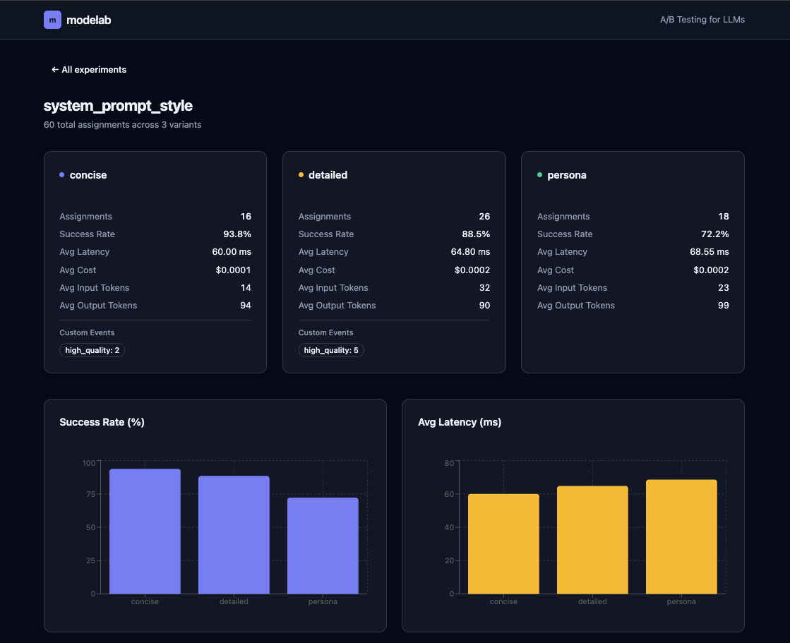
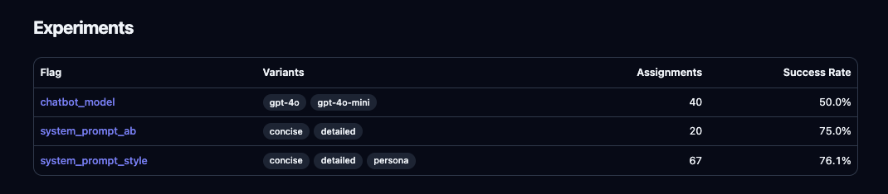

<div align="center">

# 🧪 modelab

**Production-grade A/B testing for LLM systems**

[](https://pypi.org/project/modelab/)
[](https://www.python.org/downloads/)
[](https://opensource.org/licenses/MIT)
[](https://github.com/elliot736/modelab/actions/workflows/ci.yml)

[Quick Start](#-quick-start) • [Features](#-features) • [Dashboard](#-dashboard) • [Documentation](#-documentation)

</div>

---

## 🎯 Why modelab?

You've built an LLM app. Now you need to know if Claude-Opus-4.6 is actually worth 10x the cost of GPT-5.2-flash, or if your new prompt performs better than the old one. That's where modelab comes in.

modelab solves this by giving you:

- **🔬 Statistically rigorous A/B testing**: deterministic bucketing, configurable rollouts, and precise traffic splitting
- **📊 Real-time metrics**: track success rates, latency, cost, and token usage per variant
- **🚀 Zero vendor lock-in**: works with OpenAI, Anthropic, or any LLM provider
- **🛡️ Production-safe**: fail-soft design, zero dependencies in SDK, automatic metric buffering
- **🎨 Beautiful dashboard**: self-hosted React UI for visualizing experiment results

Perfect for ML engineers who need to answer questions like:

- Is GPT-4 worth 10x the cost over GPT-3.5 for this use case?
- Does prompt A produce better summaries than prompt B?
- Should we roll out the new retrieval strategy to 100% of users?

---

## ⚡ Quick Start

### Installation

```bash
pip install modelab
```

### Run the server + dashboard

```bash
docker compose up
```

This starts:

- **PostgreSQL** on port 5432
- **modelab API + dashboard** on [http://localhost:8100](http://localhost:8100)

### Run your first experiment

```python
import modelab
from modelab import Flag, Variant, EvalContext

# 1. Define your experiment
modelab.init(
    server="http://localhost:8100",
    flags=[
        Flag(
            name="summarizer_model",
            variants=[
                Variant("gpt35", weight=50, config={"model": "gpt-3.5-turbo"}),
                Variant("gpt4", weight=50, config={"model": "gpt-4"}),
            ],
            rollout_pct=100,  # 100% of users in experiment
        ),
    ],
)

# 2. Assign a variant
ctx = EvalContext(user_id="user_123")
assignment = modelab.assign("summarizer_model", ctx)


# 3. Use the assigned variant
response = openai.ChatCompletion.create(
        model=assignment.config["model"],
        messages=[{"role": "user", "content": "Summarize this..."}],
    )

# 4. Track metrics
assignment.record(
        response,  # Auto-extracts tokens from OpenAI/Anthropic responses
        cost=0.013,
        latency_ms=250.0,
    )
assignment.mark_success()

# 5. Evaluate results
results = modelab.evaluate("summarizer_model")
print(results)
```

**Output:**

```json
{
  "flag_name": "summarizer_model",
  "total_assignments": 1000,
  "variants": [
    {
      "variant_name": "gpt35",
      "assignments": 502,
      "success_rate": 0.94,
      "avg_latency_ms": 180.5,
      "avg_cost": 0.003
    },
    {
      "variant_name": "gpt4",
      "assignments": 498,
      "success_rate": 0.97,
      "avg_latency_ms": 420.2,
      "avg_cost": 0.013
    }
  ]
}
```

---

## ✨ Features

### Deterministic Assignment

Same `(flag_name, user_id)` always maps to the same variant. No randomness, no drift.

```python
# User "alice" always gets the same variant
assignment1 = modelab.assign("experiment", EvalContext(user_id="alice"))
assignment2 = modelab.assign("experiment", EvalContext(user_id="alice"))
assert assignment1.variant_name == assignment2.variant_name
```

### Granular Rollouts

Control what percentage of users enter the experiment (0.01% precision).

```python
Flag(
    name="risky_feature",
    variants=[Variant("control"), Variant("experimental")],
    rollout_pct=5.0,  # Only 5% of users see this
)
```

### Flexible Traffic Splitting

Weighted variants let you bias traffic (e.g., 90% control, 10% treatment).

```python
Flag(
    name="prompt_test",
    variants=[
        Variant("baseline", weight=90),
        Variant("experimental", weight=10),
    ],
    rollout_pct=100,
)
```

### Provider-Agnostic Tracking

Duck-typed token extraction works with OpenAI, Anthropic, or custom responses.

```python
# OpenAI
assignment.record(openai_response)  # Auto-extracts prompt_tokens, completion_tokens

# Anthropic
assignment.record(anthropic_response)  # Auto-extracts input_tokens, output_tokens

# Custom
assignment.record(input_tokens=50, output_tokens=100, cost=0.01)
```

### Custom Events

Track domain-specific metrics beyond success/failure.

```python
assignment.mark_success()
assignment.mark_failure()
assignment.mark_custom_event("copied_to_clipboard")
assignment.mark_custom_event("thumbs_up", payload={"rating": 5})
```

### Fail-Soft Design

Storage failures log warnings but **never crash your app**.

```python
# Even if the server is down, this won't raise
assignment.record(response, cost=0.01)
assignment.mark_success()
```

---

## 🎨 Dashboard

The self-hosted dashboard gives you real-time visibility into experiment performance with a modern dark mode interface:

<div align="center">

<p><em>Experiments overview with variant badges and success rate metrics</em></p>
</div>

<div align="center">

<p><em>Detailed flag view with per-variant metrics and comparison charts</em></p>
</div>

**Features:**

- 📊 Per-variant success rates, latency, cost, and token usage
- 📈 Time-series charts for trend analysis
- 🎯 Flag-level summaries with statistical significance
- 🌙 Modern dark mode interface built with shadcn/ui
- ⚡ Real-time updates and responsive design

---

## 📚 Documentation

### Core Concepts

#### Flags

An experiment with one or more variants and a rollout percentage.

```python
Flag(
    name="my_experiment",
    variants=[...],
    rollout_pct=50.0,  # 0-100% (0.01% precision)
)
```

#### Variants

Each variant has a name, weight, and a config dict.

```python
Variant(
    name="treatment",
    weight=50,  # Relative weight for traffic splitting
    config={"model": "gpt-4", "temperature": 0.7},  # Your LLM parameters
)
```

#### EvalContext

Identifies who's being assigned (used for deterministic bucketing).

```python
EvalContext(
    user_id="user_123",      # Required
    session_id="session_abc"  # Optional
)
```

#### Assignment

Returned by `modelab.assign()`. Contains the variant config and tracking methods.

```python
assignment = modelab.assign("flag_name", ctx)
if assignment:
    model = assignment.config["model"]
    assignment.record(response, cost=0.01)
    assignment.mark_success()
```

---

### Server API

#### Ingestion (from SDK)

```
POST /api/v1/ingest/assignments    # Batch assignment records
POST /api/v1/ingest/executions     # Batch execution metrics
POST /api/v1/ingest/events         # Batch events (success/failure/custom)
```

#### Dashboard API

```
GET /api/v1/flags                  # List all flags with summary stats
GET /api/v1/flags/{name}           # Detailed per-variant metrics
GET /api/v1/flags/{name}/timeline  # Time-series data
```

---

### How Assignment Works

1. **Hash** `flag_name:user_id` → MD5 digest
2. **Bucket** digest modulo 10,000 → bucket in [0, 9999]
3. **Rollout gate** if bucket < (rollout_pct / 100 \* 10000), proceed; else return `None`
4. **Variant selection** bucket modulo (sum of weights) → select variant by cumulative weight

**Example:**

```python
Flag(name="test", variants=[Variant("A", weight=50), Variant("B", weight=50)], rollout_pct=100)
user_id="alice" → hash → bucket 4231 → rollout ✓ → 4231 % 100 = 31 → variant A
user_id="bob"   → hash → bucket 8765 → rollout ✓ → 8765 % 100 = 65 → variant B
```

This guarantees:

- Same user always gets same variant (deterministic)
- Variants split traffic according to weights (50/50 in this case)
- 0.01% rollout precision (10,000 buckets)

---

## 🏗️ Architecture

```
┌─────────────────────────────────────┐
│      Your Application               │
│  ┌──────────────────────────────┐   │
│  │  modelab SDK                 │   │
│  │  (pip install modelab)       │   │
│  │                              │   │
│  │  • assign()                  │   │
│  │  • record()                  │   │
│  │  • evaluate()                │   │
│  └──────────┬───────────────────┘   │
│             │ HTTP POST             │
└─────────────┼───────────────────────┘
              │
              ▼
┌─────────────────────────────────────┐
│  modelab Server (Docker Compose)    │
│  ┌─────────────────────────────┐    │
│  │  FastAPI Backend            │    │
│  │  • /api/v1/ingest/*         │    │
│  │  • /api/v1/flags/*          │    │
│  └─────────────┬───────────────┘    │
│                │                     │
│  ┌─────────────▼───────────────┐    │
│  │  PostgreSQL                 │    │
│  │  • assignments              │    │
│  │  • executions               │    │
│  │  • events                   │    │
│  └─────────────────────────────┘    │
│                                      │
│  ┌─────────────────────────────┐    │
│  │  React Dashboard (port 8100)│    │
│  │  • Flag overview            │    │
│  │  • Variant comparison       │    │
│  │  • Time-series charts       │    │
│  └─────────────────────────────┘    │
└─────────────────────────────────────┘
```

---

## 🛠️ Development

### Setup

```bash
# Clone the repo
git clone https://github.com/elliot736/modelab.git
cd modelab

# Install SDK in editable mode with dev dependencies
pip install -e ".[dev]"

# Run tests
pytest

# Run linter
ruff check .

# Run type checker
mypy modelab
```

### Running the server locally

```bash
# Start Postgres + server + dashboard
docker compose up

# Or run the API server directly (requires Postgres)
uvicorn server.app:app --reload --port 8100
```

### Running the dashboard dev server

```bash
cd dashboard
npm install
npm run dev
```

---

## 🤝 Contributing

Contributions are welcome! Please feel free to submit a Pull Request.

1. Fork the repository
2. Create your feature branch (`git checkout -b feat/amazing-feature`)
3. Commit your changes using [Conventional Commits](https://www.conventionalcommits.org/) (`git commit -m 'feat: add amazing feature'`)
4. Push to the branch (`git push origin feat/amazing-feature`)
5. Open a Pull Request

---

## 📄 License

MIT License - see [LICENSE](LICENSE) for details.

---

## 🌟 Show Your Support

If modelab helps you ship better LLM products, give it a ⭐️ on [GitHub](https://github.com/elliot736/modelab)!

---

<div align="center">

**Built with ❤️ by [elliot736](https://github.com/elliot736)**

[Report Bug](https://github.com/elliot736/modelab/issues) • [Request Feature](https://github.com/elliot736/modelab/issues)

</div>
